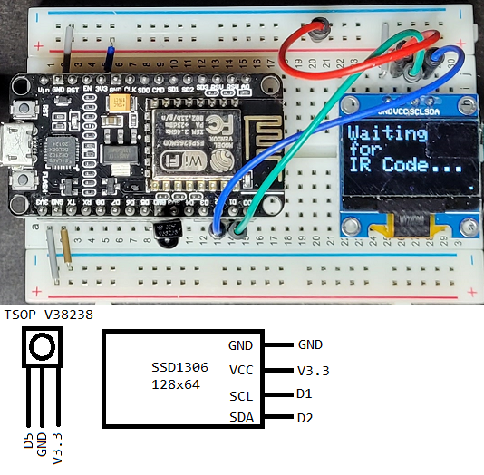
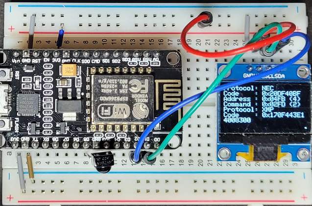

# ESP8266IRRecord

Simple project using an ESP8266 + TSOP38238 to record remote control IR Codes and display them on a little SSD1306 128x64 screen.

This is a platform IO project.

## Hardware
- ESP8266 (I think mine is a HiLetgo, but there are MANY other options)
- TSOP V38238 (https://www.adafruit.com/product/157)
- SSD1306  128x64

## Setup


|SSD1306 Pin|ESP8266 Pin|
|:-|:-|
|SCL|D1|
|SDA|D2|
|GND|GND|
|VCC|V3.3|

|TSOP 38238 Pin|ESP8266 Pin|
|:-|:-|
|OUT|D5|
|GND|GND|
|VCC|V3.3|

This image shows initial state when powered up:


This image shows output when Comcast remote (mapped to Vizio TV) Volume Up button is pressed.


I just noticed, even though I have the remote mapped to the Vizio TV (code 11758) the IR code being shown is NOT the Vizio Volume Up code (0x20DF12ED), but it still works.  The XFinity XR2 (also mapped to my TV), shows same code.

So, whatever 0x20DF40BF really is, it still works for my TV (Vizio VO32L HDTV10A).  ¯\\\_(ツ)_/¯

**Trivia**: 0x170F443E14008300  is actually some kind of NOP code Comcast and XFinity remote controls send, when mapped to my TV.

## Code

Some of the IR Code is based on examples from:<br>
https://github.com/crankyoldgit/IRremoteESP8266/

Some of the Display code is based on:<br>
https://github.com/adafruit/Adafruit_SSD1306<br>
https://github.com/adafruit/Adafruit-GFX-Library

The project was created using Platform IO in VSCode

Libraries added (see platformio.ini):
- crankyoldgit/IRremoteESP8266@^2.8.6
- adafruit/Adafruit SSD1306@^2.5.13
- adafruit/Adafruit GFX Library@^1.11.11

Not much else to say.  I've added a lot of comments in the code that should explain how it works.  It simply records and displays.

The main value of this project for me is what gets spewed to the monitor via Serial outputs.

I used this project to record IR codes from several remote controls and simple copied those values from the serial monitor to a spreadsheet, to be used in later projects.

One thing of note is the "Hack" to accomodate the small display size. 

The little dot in the lower-right of the screens in the images above, is the one referred to in the "Hack".

Comment from the code explaining...
```cpp
/*
    HACK:
    The SSD1306 128x64 screen is only 8 lines tall at TEXT_SIZE_SMALL size
    and if more than 2 IR codes are received, additional codes will bleed
    off the bottom of the display (no built-in scrolling capabilities)

    The 'hack' here is to clear the screen each time codes are to be shown, but
    still show all that were returned for one button press.

    Loop() checks IRrecv.decode() each loop, and to prevent a second IR code
    from causing the display to clear, we use the following variables and
    constant to give a little grace time and allow multiple codes per button
    press to be shown.  This is the case for remotes like the Comcast or Xfinity
    XR2 remotes that may send multiple IR codes (Both NEC and XMP).
    
    NOTE: The XFinity XR2 actually emits 3 IR Codes for the "All Power" button.
    No special case in this code to handle that. It just shows up as partial
    output.

    Once the CLEAR_AFTER_MILLISECONDS time has elapsed, the next button press
    (and thus new IR code(s) are received), the display will be cleared and
    results will be shown.  This saves on having to have a reset button.

    Press quick enough (before CLEAR_AFTER_MILLISECONDS elapses), and you can
    see the behavior of multiple codes being lost off the bottom of the screen.

    As a visual, a little 2x2 square is drawn in the lower-right corner of the
    screen after CLEAR_AFTER_MILLISECONDS has passed which means pressing a
    button on the remote will cause the screen to be cleared first.  Pressing
    a button before this square is shown, means new code(s) will likely be drawn
    off the bottom of the screen.

    Yes, quite a hack, but this entire thing is only used to gather and test
    codes for more _important_ projects that emit them :o)
*/
```